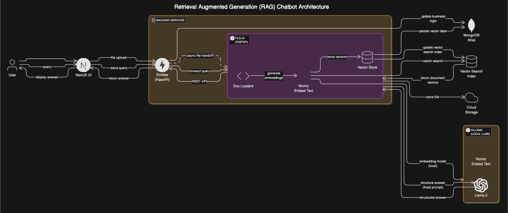
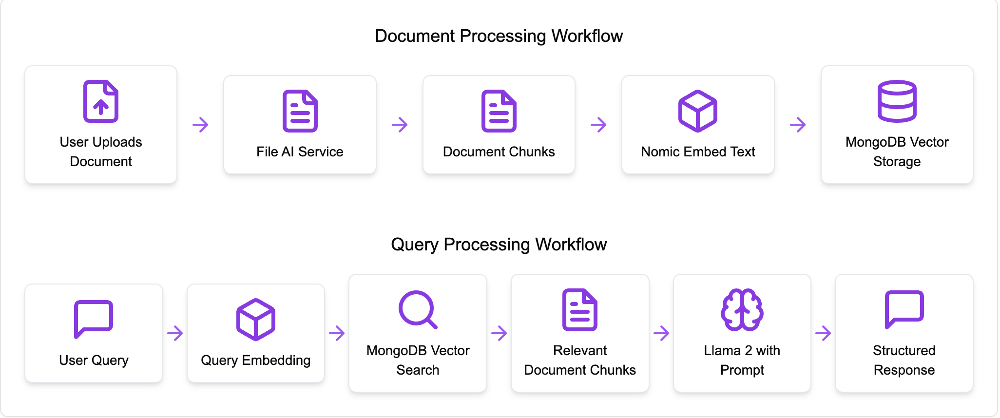
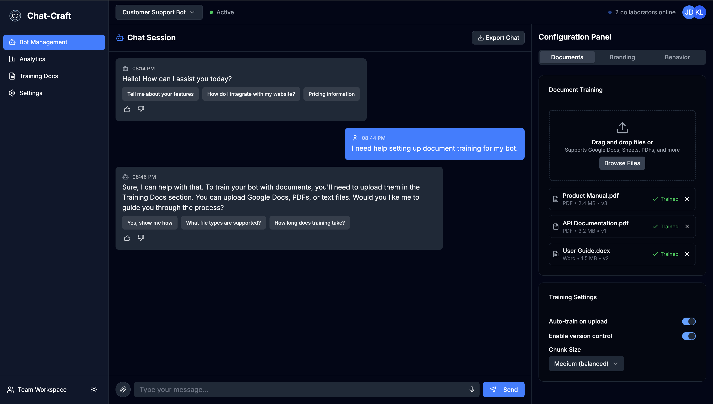

# Enterprise-Chatbot - Chatbot as a Service (CaaS) Platform

Empower your enterprise with a customizable chatbot service that leverages your internal knowledge base to provide accurate, context-aware answers.

---

## Overview

**Enterprise-Chatbot** is a chatbot-as-a-service RAG platform built for enterprises seeking to break down knowledge silos and streamline internal information retrieval. By leveraging your organization's documents and data, Enterprise-Chatbot delivers reliable, context-aware answers using advanced Retrieval Augmented Generation (RAG) techniques.

---

## Key Features

- **Document ingestion & vectorization:** Seamlessly upload and process internal documents for instant Q&A capabilities.
- **Vector search for relevant context:** Retrieve the most pertinent information from your knowledge base for every query.
- **Structured responses via LLMs:** Ensure consistent, accurate answers with large language models fine-tuned for your data.
- **Microservices architecture:** Robust, scalable, and maintainable system design.
- **Secure & private deployment:** Keep your data safe with enterprise-grade security and deployment options.
- **Customizable UI components:** Tailor the chatbot experience to your brand and workflow.
- **Exportable iFrame Widget:** Easily embed your chatbot in any internal tool or website.

---

## System Architecture

Enterprise-Chatbot employs a modern microservices architecture, orchestrated by a central service that manages document processing, vector storage, and AI-powered responses.

**Core Services:**
- Entities Service (Orchestrator)
- File AI Service
- Cron Job Service
- UI Frontend

**Technology Stack:**
- Next.js, Tailwind CSS, Interactive UI Components
- FastAPI for backend services
- MongoDB with Atlas Vector Search
- Ollama (local LLMs), Nomic Embed Text (embeddings), Llama 2 (response generation)

---

## How It Works

### Document Processing Workflow

1. **User uploads documents**
2. **File AI Service** processes and splits documents into chunks
3. **Nomic Embed Text** converts chunks into vector embeddings
4. **Embeddings stored in MongoDB** with user metadata

### Query Processing Workflow

1. **User submits a query** via the chat interface
2. Query is embedded into a vector
3. **MongoDB Atlas Vector Search** retrieves relevant document chunks
4. Chunks are sent to **Llama 2** with a structured prompt
5. **Llama 2** generates a context-aware, structured response
6. Response is displayed in the chat interface

 ---

## Product Interface

- **Dashboard:** Manage your chatbot, analyze performance, and train with your documents.
- **Chatbot UI:** Interactive, user-friendly chat interface for seamless Q&A.
- **Configuration & Analytics:** Customize the system and gain insights into usage and knowledge gaps.
- **Exportable Widget:** Integrate the chatbot in your internal tools with a simple iFrame.

### Dashboard 

---

## Example Use Cases

- **Internal IT or HR support**
- **Onboarding and training assistance**
- **Technical documentation Q&A**
- **Customer support knowledge base**

---

## Why Enterprise-Chatbot?

- **Empower your teams:** Fast, accurate answers reduce time spent searching for information.
- **Break down silos:** Centralize knowledge and make it accessible to everyone.
- **Customizable & secure:** Tailor the chatbot to your needs and keep your data private.

---

## Get Started

Deploy Enterprise-Chatbot in your organization and transform how your teams access knowledge!

---
